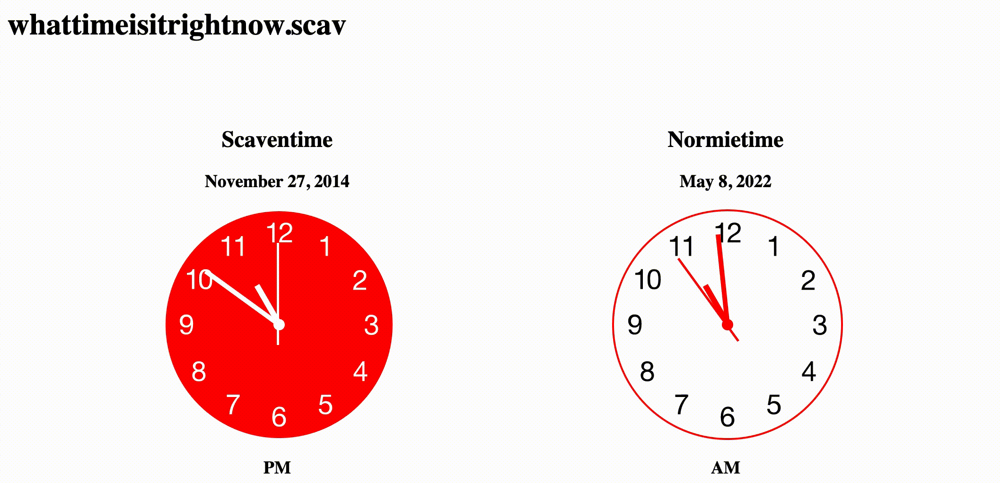
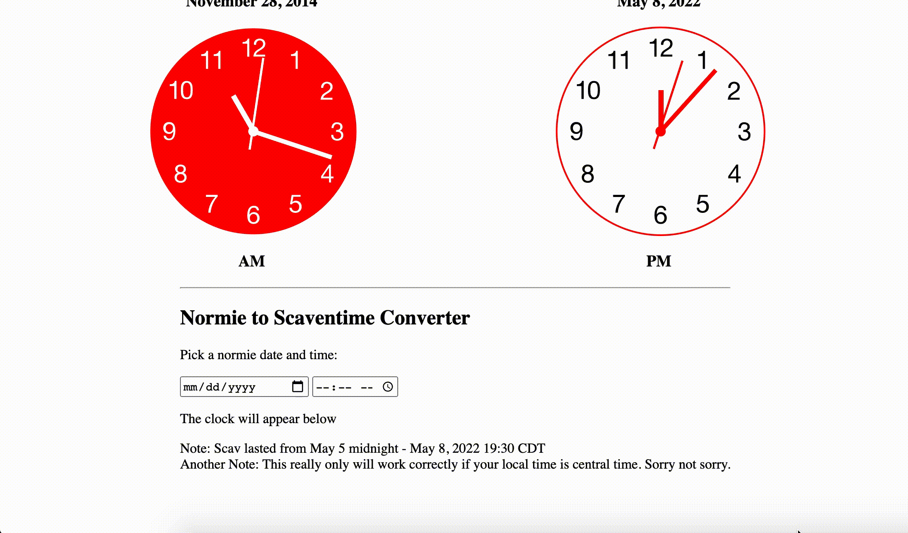

### How to

Run demo:

```
cd analog-clock
http-server
```

### Live Demo

https://whattimeisitrightnowscav.herokuapp.com/

If the link is no longer working, I took it down. Feel free to run the code locally if that's the case.

### Gif Demos!

The requested item: Shows what time it is right now during scav (as well as a comparison with the local chicago time)



For posterity! (because the clock will not work properly outside of scav 2022 dates):



### Resources
- https://www.npmjs.com/package/analog-clock
    - NOTE: When running analog-clock/demo/index.html, we cannot simply just open the local index.html file in our browser. Instead, we need to run a web server in the analog-clock dir using `npm install -g http-server` then `http-server -c-1`. This is for CORS purposes and is kind of annoying but whatever. More info: https://stackoverflow.com/questions/10752055/cross-origin-requests-are-only-supported-for-http-error-when-loading-a-local
    - NOTE: When making changes to `clock.js` script, be sure to hard-reload the page in the browser to clear the cache (cmd-shift-R)
- https://github.com/udivankin/sunrise-sunset
